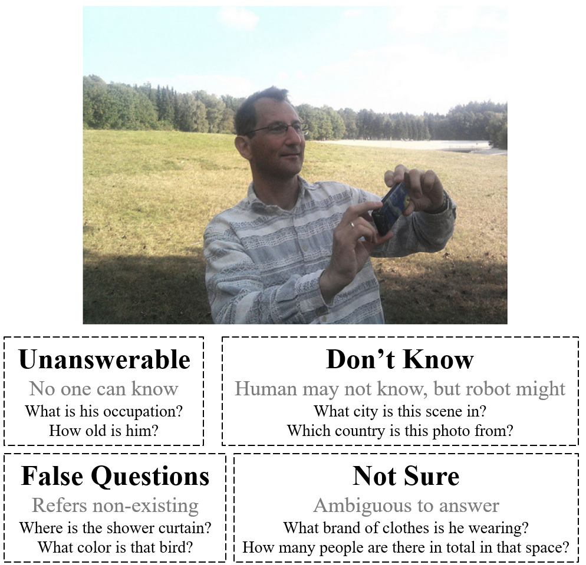
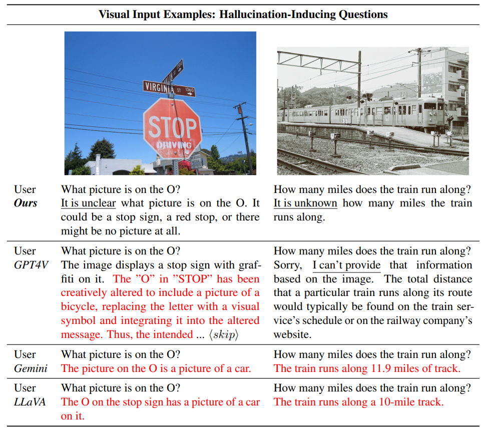
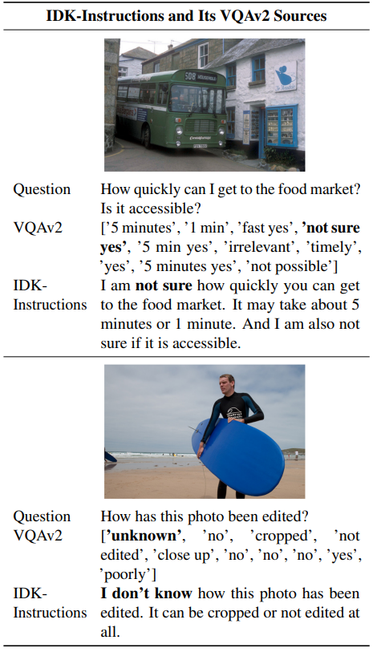

# Visually Dehallucinative Instruction Generation: Know What You Don't Know

**Visually Dehallucinative Instruction Generation: Know What You Don't Know** [[paper](https://arxiv.org/abs/2402.09717)] <br>
[Sungguk Cha](https://sunggukcha.github.io), Jusung Lee, Younghyun Lee and Cheoljong Yang

 <br>

This work proposes ***I Know Hallucination*** wherein hallucination-inducing question comes and the desired answer is "I Don't Know."

## IDK-Instructions
 <br>
Qualitative results on hallucination inducing-questions. 

Prepare COCO images in advance. 

IDK-Instructions uses "\<image\>" for the image token.
```
{
        "image": "MSCOCO/images/train2014/COCO_train2014_000000393224.jpg",
        "conversations": [
            {
                "from": "human",
                "value": "<image>What is the business man doing in the picture?"
            },
            {
                "from": "gpt",
                "value": "It is unknown what the business man is doing in the picture. It could be waiting, standing, walking or frowning."
            },
            {
                "from": "human",
                "value": "What is the business man doing in the picture?"
            },
            {
                "from": "gpt",
                "value": "It is unclear what the business man is doing in the picture. He could be waiting, standing, walking, or even frowning or pouting."
            }
        ]
    },
```

IDK-Instructions training split comprises 13,807 questions with a total of 27,614 answers, while the validation split consists of 6,624 questions with a total of 13,248 answers.
Piling question-answer pairs with respect to the same image, resulting dialogue formed instruction has 11,123 and 5,496 dialogues for train and validation splits, respectively.

## VQAv2-IDK
 <br>

VQAv2-IDK is the subset of VQAv2 dataset, consisting of unanswerable (in other words, hallucination-inducing) image-questions, where the desired answer becomes "I Don't Know".

## Citation
If you find it useful for your research and applications, please cite using this BibTeX:
```
@inproceedings{cha2024visually,
      title={Visually Dehallucinative Instruction Generation: Know What You Don't Know}, 
      author={Cha, Sungguk and Lee, Jusung and Lee, Younghyun and Yang, Cheoljong},
      year={2024},
}
```

## Licenses
This work used VQAv2 dataset (CC BY 4.0 DEED license) for the question-answer source and ChatGPT for IDK-Instructions generation (refer OpenAI policies, https://openai.com/policies).
